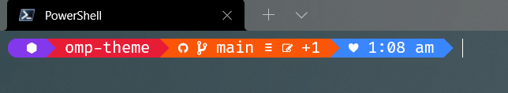
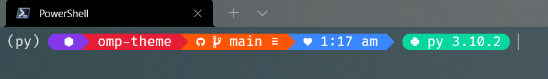
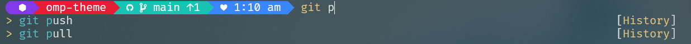

# Ultron Theme

## Pagina oficial

[Oh My Posh](https://ohmyposh.dev/)

## Tema personalizado

> .ultron.json

Basado en el tema de [M365Princess](https://github.com/JanDeDobbeleer/oh-my-posh/blob/main/themes/M365Princess.omp.json
)

## Configuracion en PowerShell

```ps
clear
Set-PSReadLineOption -PredictionSource History
Set-PSReadLineOption -PredictionViewStyle ListView

Set-PoshPrompt -Theme ~/.ultron.json
Import-Module -Name Terminal-Icons
Enable-PoshTransientPrompt
Enable-PoshLineError
```

>- clear para borrar el mensaje de bienvenida de powershell
>- Set-PSReadLineOption -PredictionSource History para que se muestren las opciones anteriores
>- Set-PSReadLineOption -PredictionViewStyle ListView para que se muestren sugerencias en forma de lista
>- Set-PoshPrompt -Theme ~/.ultron.json para usar el tema personalizado
>- Import-Module -Name Terminal-Icons para usar los iconos de la terminal
>- Enable-PoshTransientPrompt para que se muestre solo una vez la linea personalizada de la terminal
>- Enable-PoshLineError para que se muestre el error en la terminal

## Extra

Instalar las [**Nerd Fonts**](https://www.nerdfonts.com/)

Prefiero Fira Code NF, Pero sientete libre de probar alguna otra

## look and feel

**Cambios en Git**



**Entorno de python**



**Comandos sugeridos y pendientes en github**


